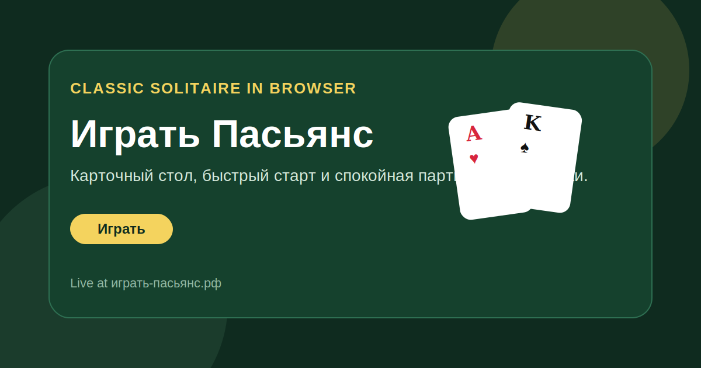

<h1 align="center">Играть Пасьянс</h1>

  Классический Solitaire в браузере: быстрый старт, спокойный ритм и знакомая карточная механика без установки.

  <a href="https://играть-пасьянс.рф/"><strong>Играть</strong></a>
  ·
  <a href="https://github.com/ivanlukichev/-"><strong>GitHub Repo</strong></a>
  ·
  <a href="https://github.com/ivanlukichev"><strong>Другие проекты</strong></a>

  

## Что Это

«Играть Пасьянс» переносит классическую карточную механику Solitaire в чистый браузерный формат. Идея простая: открыть страницу и сразу начать раскладывать колоду без регистрации, установок и лишних шагов.

Этот публичный репозиторий нужен как аккуратная витрина проекта на GitHub: с понятным описанием, ссылкой на живой сайт и быстрым пониманием, что это за продукт.

## Почему Смотрится Хорошо

- Игра понятна с первого экрана.
- Формат подходит и для коротких пауз, и для спокойной длинной партии.
- Интерфейс держит фокус на столе и картах.
- Репозиторий выглядит как публичная карточка продукта, а не просто заглушка.

## Кратко О Проекте

- Жанр: карточная игра
- Язык: русский
- Формат: браузерная версия Solitaire
- Стек: статический фронтенд
- Цель: быстрый доступ к классическому пасьянсу

## More Projects

| Project | Live site | Public repo |
| --- | --- | --- |
| Tic-Tac-Toe | [крестики-нолики.рф](https://крестики-нолики.рф/) | [---](https://github.com/ivanlukichev/---) |
| PlayBlockGame | [playblockgame.ru](https://playblockgame.ru/) | [PlayBlockGame](https://github.com/ivanlukichev/PlayBlockGame) |
| Goroda | [goroda-na.ru](https://goroda-na.ru/) | [Goroda-na](https://github.com/ivanlukichev/Goroda-na) |
| Slova Game | [slova-game.ru](https://slova-game.ru/) | [SlovaGame](https://github.com/ivanlukichev/SlovaGame) |
| Sudoku Play | [sudoku-play.org](https://sudoku-play.org/) | [Sudoku-Play](https://github.com/ivanlukichev/Sudoku-Play) |
| SkillSudoku | [skillsudoku.com](https://skillsudoku.com/) | [skillsudoku_public](https://github.com/ivanlukichev/skillsudoku_public) |
| PickWinner | [pickwinner.tools](https://pickwinner.tools/) | [pickwinner](https://github.com/ivanlukichev/pickwinner) |
| HTTPTools | [httptools.net](https://httptools.net/) | [HTTPTools](https://github.com/ivanlukichev/HTTPTools) |

## Играть

  <a href="https://играть-пасьянс.рф/"><strong>Открыть Играть Пасьянс</strong></a> 
  Классический Solitaire в браузере без установки и без лишней подготовки.

